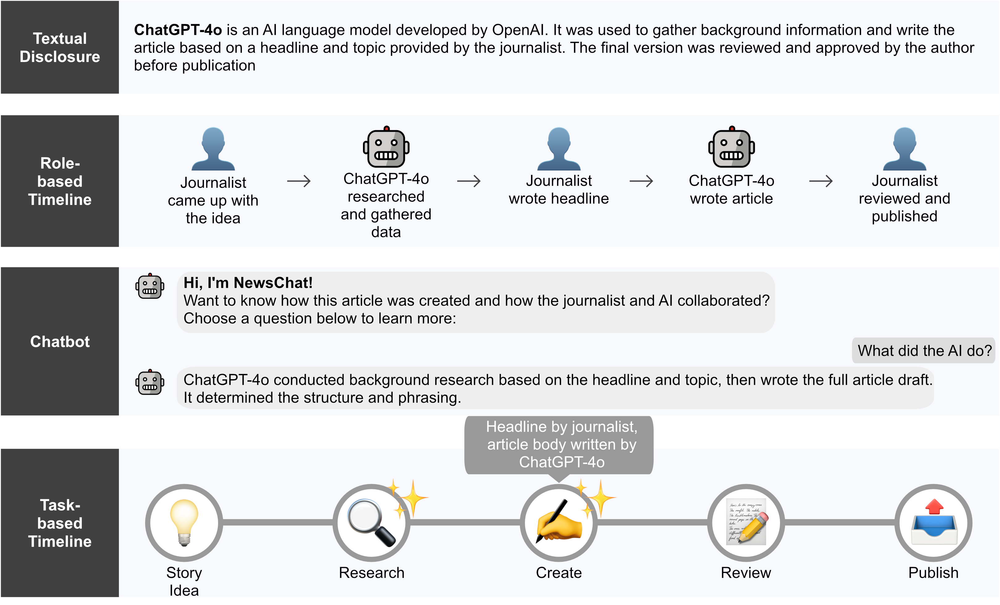

## CHI 2026 paper: Human–AI Collaboration Disclosure Visualizations for Journalism

This page contains the source files, prototypes, and supplementary materials for our CHI 2026 paper:

> ["More Human or More AI? Visualizing Human–AI Collaboration Disclosures in Journalistic News Production"](preprint/chi26-1013.pdf)

<p align="center">
  
</p>

## Prototype Overview

This includes the four disclosure visualization prototypes evaluated in our study:

- **Textual Disclosure**
- **Role-based Timeline**
- **Task-based Timeline**
- **Chatbot Disclosure**

Each prototype represents different ways of communicating **human versus AI contribution in news production** and are intended as reusable design artifacts for HCI, AI transparency, journalism, and disclosure research.


## Source Files

The `/source` folder contains the disclosure visualization files.

### Repository Structure

```text
src/
├── components/
│   ├── PrototypeGallery.js
│   └── visualisations/
│       ├── TextualDisclosure.js
│       ├── RoleBasedTimeline.js
│       ├── Chatbot.js
│       └── TaskBasedTimeline.js
│
├── data/
│   └── demoContent.js
│
├── styles/
│   └── prototypes.css
│
├── App.js
└── index.js
```

### Key files

- **PrototypeGallery.js** → renders the four demo prototypes
- **demoContent.js** → contains all example content and interaction data
- **visualisations/** → reusable disclosure components
- **prototypes.css** → styling for all prototype layouts

## Installation

After cloning or downloading the `/source` folder, install dependencies:

```bash
npm install
```

Start the local demo:

```bash
npm start
```

The demo will open at:

```text
http://localhost:3000
```

## How to Reuse the Prototypes

Each prototype is a standalone React component.

Example:

```jsx
import Chatbot from "./components/visualisations/Chatbot";
import demoContent from "./data/demoContent";

<Chatbot currentViz={demoContent.chatbot} />
```

To adapt the prototypes:

- edit the content in `src/data/demoContent.js`
- replace icons/images in `public/images/`
- modify visual styling in `src/styles/prototypes.css`
- embed components into your own React applications

## Preprint + Videos

- **Preprint (.pdf)**
  ["CHI '26 Human-AI Collaboration Disclosure paper"](preprint/chi26-1013.pdf)

- **30s video preview (.mp4)**  
  [Video preview](videos/30s_preview.mp4)

- **8-min presentation video**  
  Link will be added after publication on SIGCHI's YouTube channel.

## Supplementary Material

The `/supplementary_material` folder contains:

- “A-Design_Results.pdf” —> A document showing the processed results of the co-design sessions. Including 69 design ideas, analyzed for Disclosure type, Category, Placement Textual/Visual. Additionally, showing all four prototypes for two collaboration ratios Refers to Sec. 3.1.3 and 3.3.

- “B-User_Study_Materials.pdf” —> A document showing the questionnaire and interview questions of the user study, and the news article stimuli. Refers to Sec. 4.1.1 and 4.3.2. 

- “C-Post-Hoc_Interactions.pdf” —> A document showing the full set of pos-hoc interactions for perceived human-AI collaboration dynamics, perceived role of AI, perceived clarity and value, perceived information, and for gaze features resulting from resulting from analysis using LMM and CLMM. Refers to Sec. 4.4.1 - 4.4.14.


## Citing this paper or prototypes

**Please cite our paper in any published work that uses any of these resources.**

### BibTeX
```bibtex
@inproceedings{Kusters2026,
  author = {Kusters, Amber and Prajod, Pooja and Cesar, Pablo and El Ali, Abdallah},
  title = {More Human or More AI? Visualizing Human–AI Collaboration Disclosures in Journalistic News Production},
  year = {2026},
  isbn = {979-8-4007-2278-3/26/04},
  publisher = {Association for Computing Machinery},
  url = {https://doi.org/10.1145/3772318.3791288},
  booktitle = {Proceedings of the 2026 CHI Conference on Human Factors in Computing Systems (submitted)},
  location = {Barcelona, Spain},
  series = {CHI '26}
}
  ```

ACM Ref Citation:

*Amber Kusters, Pooja Prajod, Pablo Cesar and Abdallah El Ali (2026). More Human or More AI? Visualizing Human–AI Collaboration Disclosures in Journalistic News Production. In CHI Conference on Human Factors in Computing Systems (CHI ’26). April 13-April 17, 2026, Barcelona Spain. ACM, New York, NY, USA, 22 pages. [https://doi.org/10.1145/3491102.3517451](https://doi.org/10.1145/3772318.3791288)*

## Contact

If you have any questions about the above, you can drop us an email:

* [Amber Kusters](mailto:Amber.Kusters@cwi.nl)
* [Abdallah El Ali](mailto:aea@cwi.nl)
